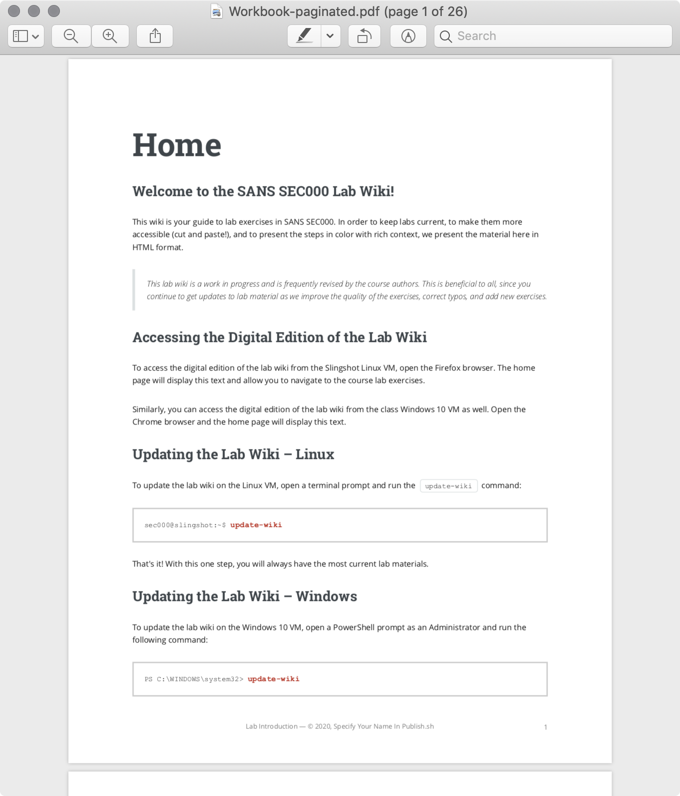
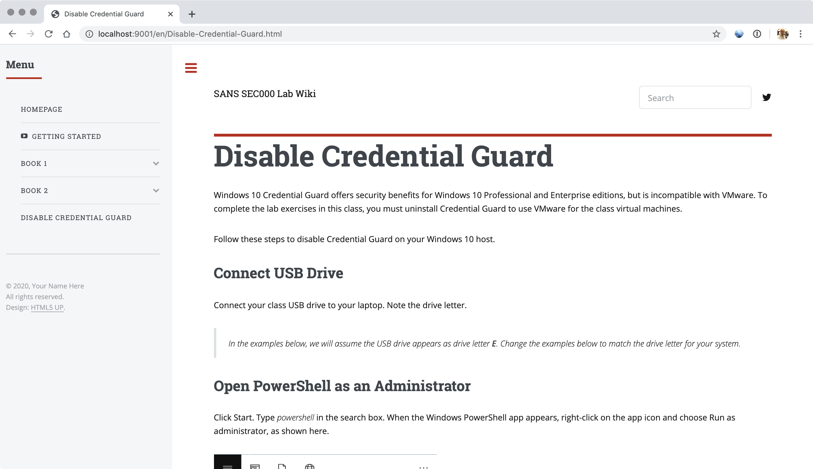

# SANS Markdown Wiki Template

## Introduction

This lab template system is a product of initial SEC504 development by John
Strand and Mick Douglas, then continued refinement by Mick and Josh Wright. It
aims to provide a simple mechanism for writing and maintaining lab exercises,
with emphasis on an attractive product (print and electronic) for students.

Questions, comments, concerns? Contact josh@wr1ght.net

## TL/DR Instructions

Run on Linux, macOS, or WSL. Install Pandoc, Puppeteer, Python 3, and PDFtk.
Use the examples in `content/en` to create your labs. Edit
`content/wiki-template.html` to specify the order of your lab files by day. Run
`./publish.sh` to generate the HTML files for electronic distribution to
students and the workbook PDF. Run `./paginate.py` to add page numbers to the
workbook. Run `./clean.sh` to remove all the temporary files, then commit.

## Seeing the Product

Want to see what the product is before you read anything else? Screenshot
below from the print workbook and the HTML _wiki_ content. See the sample
PDF in `sample/Workbook-paginated.pdf`. See the sample HTML content in
`sample/wiki/index.html`.





## Dependencies Required

Dependencies for building the workbooks:

+ Pandoc - https://pandoc.org/
+ Puppeteer - https://github.com/GoogleChrome/puppeteer (install NPM, then 
  `npm i -g puppeteer`)
+ Python 3 - https://www.python.org
+ PDFtk - https://www.pdflabs.com/tools/pdftk-the-pdf-toolkit/

Optionally run `./publish.sh check` to verify that the required utilities
are installed.

## Getting Started

Some getting started recommendations:

  + Change the AUTHOR line in the beginning of the `publish.sh` script for the
    PDF footer
  + Add your Markdown files to `content/en`; you can also add localization in
    other directories (e.g. `content/jp`)
  + Edit the `lab-order.txt` file to specify the order of your lab files for
    the workbook PDF
  + Edit the `content/wiki-template.html` file to organize your labs and links
    for each book as desired

## Building the Lab Files

To generate the lab files, change to the top-level directory, then run
the `./publish.sh` script:

```
markdown-labtemplate $ ./publish.sh
Generating HTML content (en)
Generating search index (en)
Generating print content (en): ....
```

This script produces all of the lab HTML files in the `wiki/` directory.
The contents of this directory can be distributed to students for lab use
(more on distribution thoughts below). The file `Workbook-en.pdf` is the
formatted PDF file is intended to be printed.

The `Workbook-en.pdf` file is not paginated; run the `./paginate.sh` script
to modify the PDF file to add page numbers:

```
markdown-labtemplate $ ./paginate.sh Workbook-en.pdf Workbook-en-paginated.pdf
Paginating Workbook-en.pdf
..........................
Done: Workbook-en-paginated.pdf
```

## Previewing Lab Content

To preview web content, run a Python web server from the `wiki/` directory:

```
markdown-labtemplate $ cd wiki/
wiki $ python -m http.server --bind 127.0.0.1 9001
Serving HTTP on 127.0.0.1 port 9001 (http://127.0.0.1:9001/) ...
```

Browse to the selected port to see the content.

## Removing Temporary Lab Content

Run the `./clean.sh` script to remove the temporary file content (e.g.  the
`html/`, `print/`, and `Workbook-en.pdf` content. This content is regenerated
when you run `./publish.sh`, so there is no need to check it in to Git.

## Building HTML Faster [OPTIONAL]

By default, `./publish.sh` will generate HTML and PDF files. PDF file
generation is only needed when courseware updates are turned in, so you may
want to skip that step if you are working on an interim lab update. If so, add
the `noprint` argument to the `./publish.sh` script:

```
markdown-labtemplate $ ./publish.sh noprint
Generating HTML content (en)
Generating search index (en)
Skipping print file production.
```

## Distributing Lab Files

The paginated workbook PDF file is intended to be included with the
courseware update for print purposes. The contents of the `wiki/` directory
are intended to be distributed to students for electronic access to the
labs. For SEC504, this is the https://github.com/joswr1ght/SANS-504-Student-wiki
repository.

To distribute the lab wiki (HTML) files, they must be served through a web server
on the student VM. You cannot access the files through the `file:///` URL due to
CORS. Consider deploying local Nginx web servers on your VMs (use NSSM.exe to
serve Nginx as a service on Windows).
